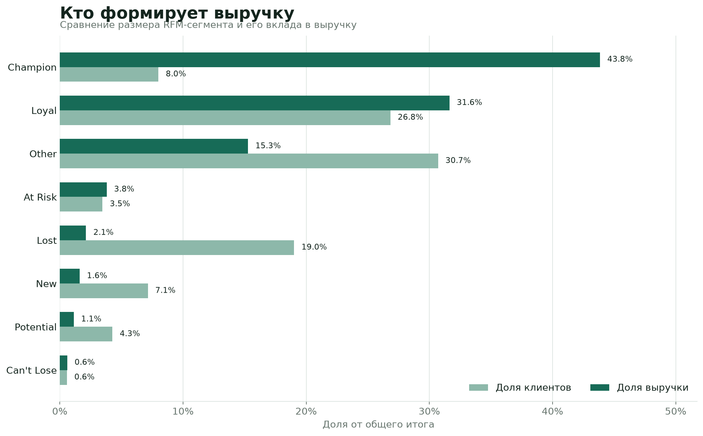
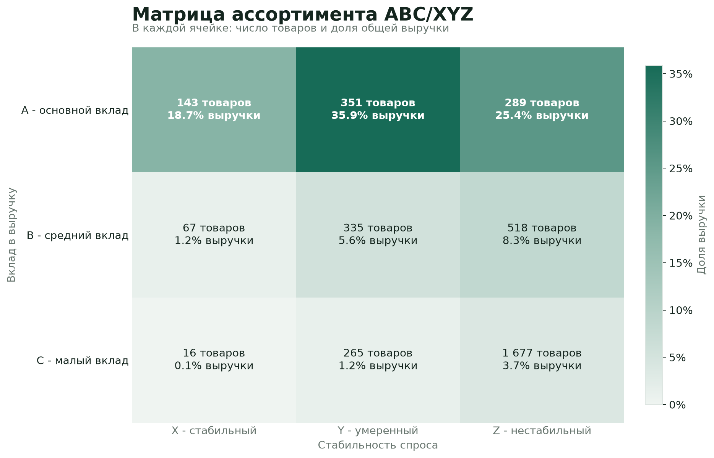
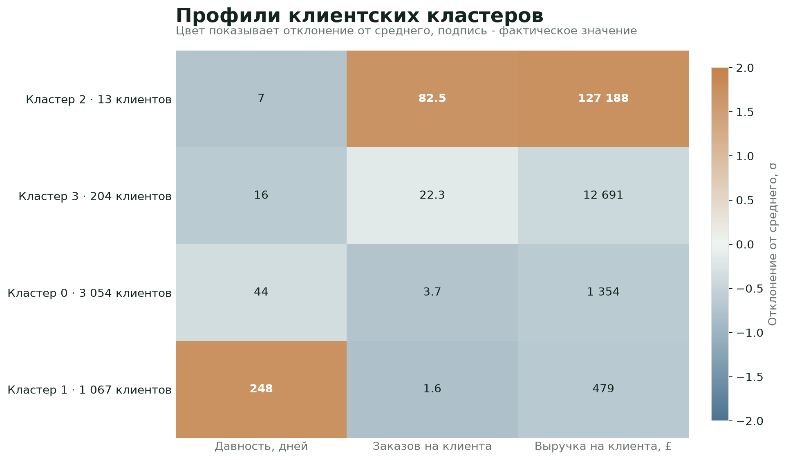
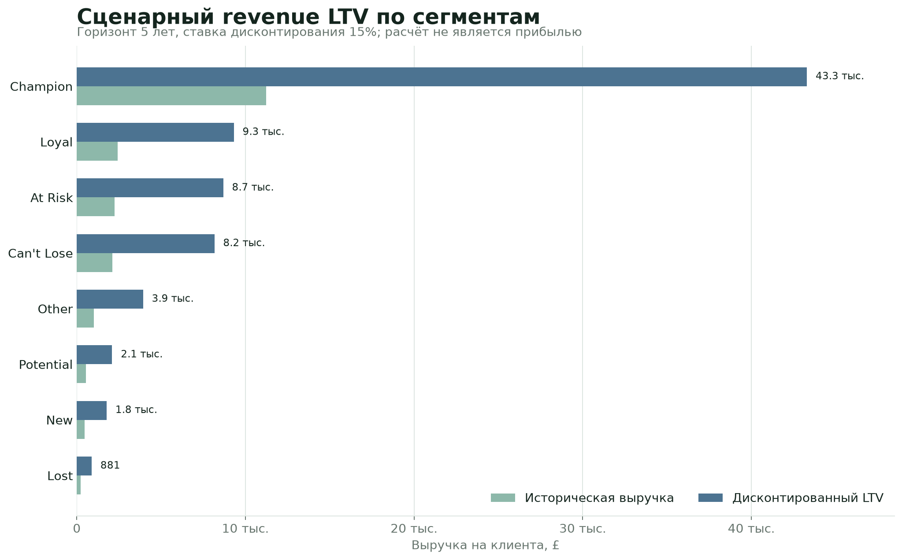

# Аналитика клиентской базы интернет-магазина


Воспроизводимый анализ 541 909 транзакционных строк из набора Online Retail: очистка данных, RFM-сегментация, ABC/XYZ-анализ, кластеризация, демонстрационный A/B-тест, классификация риска неактивности и сценарный LTV.

Проект отвечает на три практических вопроса:

- какие клиенты и товары формируют основную выручку;
- кого приоритизировать в удержании;
- какие выводы подтверждены данными, а какие зависят от модельных предположений.



## Основные результаты

- После очистки осталось 392 692 валидных строки из 541 909 исходных.
- Около 8% клиентов сегмента Champion формируют примерно 44% выручки.
- ABC/XYZ-матрица отделяет товары с высоким вкладом и стабильным спросом от менее предсказуемого ассортимента.
- K-means выявляет небольшой высокоценный кластер, который не полностью отражается правилами RFM.
- A/B-блок показывает полный расчёт бинарного эксперимента, но использует синтетические данные и не доказывает реальный эффект скидки. Для эффекта 10% против 15% расчёт требует около 686 наблюдений на группу, а в демонстрации их 84.
- Блок churn оценивает текущий риск неактивности. На тестовой выборке recall рискового класса около 0,92, но precision только около 0,34, поэтому это широкий скрининг, а не готовая модель кампании и не прогноз ухода во времени.
- LTV рассчитан как сценарная выручка на клиента с явными предположениями о churn, ставке дисконтирования, горизонте и CAC.

## RFM-сегменты

| Сегмент | Клиенты | Доля клиентов | Выручка, £ | Доля выручки |
|---|---:|---:|---:|---:|
| Champion | 347 | 8,0% | 3 896 691 | 43,8% |
| Loyal | 1 164 | 26,8% | 2 810 820 | 31,6% |
| Other | 1 332 | 30,7% | 1 357 810 | 15,3% |
| At Risk | 150 | 3,5% | 337 851 | 3,8% |
| Lost | 825 | 19,0% | 188 492 | 2,1% |
| New | 310 | 7,1% | 142 239 | 1,6% |
| Potential | 185 | 4,3% | 100 400 | 1,1% |
| Can't Lose | 25 | 0,6% | 52 907 | 0,6% |

## Ассортимент

Матрица сочетает вклад товара в выручку и стабильность помесячного спроса. Самая крупная зона AY содержит 351 товар и формирует 35,9% выручки.



## Клиентские кластеры

Кластеризация выделила 13 клиентов с высокой частотой заказов и средней выручкой около 127 тыс. £. Названия кластеров не задаются заранее: интерпретация строится по фактическому профилю.



## Сценарный LTV



Показатели A/B-демонстрации и модели риска:

| Блок | Метрика | Результат | Интерпретация |
|---|---|---:|---|
| A/B-тест | Размер групп | 84 + 84 | Синтетический пример |
| A/B-тест | Возврат, контроль / тест | 6,0% / 19,0% | Эффект +13,1 п.п. |
| A/B-тест | p-value | 0,0197 | Не переносится на реальную кампанию |
| Планирование | Выборка на группу | 686 | Для эффекта 10% против 15%, power 80% |
| Churn risk | Recall | 92,2% | Модель находит большинство рисковых клиентов |
| Churn risk | Precision | 33,8% | Около двух третей срабатываний ложные |
| Churn risk | F1 | 49,4% | Модель требует доработки перед применением |

## Что реализовано

| Этап | Результат |
|---|---|
| Очистка | Валидные продажи и отчёт о количестве строк, удалённых каждым правилом |
| RFM | Метрики клиентов, квинтильные баллы, взаимоисключающие сегменты и сводка выручки |
| ABC/XYZ | Вклад товара в выручку и стабильность спроса с учётом месяцев без продаж |
| Кластеризация | K-means по стандартизированным RFM-признакам и профиль каждого кластера |
| A/B-тест | Таблица из наблюдений, p-value, абсолютный и относительный эффект, 95% ДИ, размер выборки |
| Churn risk | Логистическая классификация текущего риска и отчёт precision/recall |
| LTV | Исторический, простой и дисконтированный revenue LTV по сегментам |

## Быстрый запуск

Требуется Python 3.11 или новее.

```bash
python -m venv .venv
source .venv/bin/activate
pip install -e ".[dev]"

ecommerce-analysis --input "Online Retail.xlsx" --output artifacts
ecommerce-figures --artifacts artifacts --output assets
pytest -q
```

Команда создаёт в `artifacts/` очищенные данные, таблицы RFM, ABC/XYZ, кластеров, LTV и сводный `summary.json`. Папка не хранится в Git, потому что полностью восстанавливается из исходного файла.

Вторая команда пересобирает четыре графика README из результатов пайплайна.

## Ноутбуки

Ноутбуки лежат в `notebooks/` и используют функции из пакета, а не копируют расчёты:

1. `01_data_cleaning.ipynb`
2. `02_rfm_segmentation.ipynb`
3. `03_abc_xyz.ipynb`
4. `04_customer_clustering.ipynb`
5. `05_ab_test.ipynb`
6. `06_churn_risk.ipynb`
7. `07_ltv.ipynb`

Каждый ноутбук содержит постановку задачи, методические оговорки и интерпретацию. Основная логика находится в `src/ecommerce_analysis/` и проверяется автоматически.

Для локального запуска JupyterLab:

```bash
pip install -e ".[notebook]"
jupyter lab
```

## Структура

```text
src/ecommerce_analysis/   переиспользуемое вычислительное ядро
notebooks/                пошаговый аналитический разбор
tests/                    тесты очистки, RFM и A/B-логики
artifacts/                генерируемые результаты, не хранится в Git
assets/                   графики для README
Online Retail.xlsx        исходный публичный набор данных
pyproject.toml            зависимости и команда запуска
```

## Данные

Использован публичный набор [Online Retail](https://archive.ics.uci.edu/dataset/352/online+retail) из UCI Machine Learning Repository. Он содержит транзакции британского интернет-магазина за период с декабря 2010 по декабрь 2011 года; цены указаны в фунтах стерлингов. Набор опубликован Daqing Chen по лицензии CC BY 4.0, DOI: [10.24432/C5BW33](https://doi.org/10.24432/C5BW33).

## Методические ограничения

- Синтетический A/B-тест демонстрирует методику, а не фактический эффект маркетинговой акции.
- Churn-метка создана по порогу давности покупки. Для прогноза будущего оттока нужна временная целевая переменная и temporal validation.
- LTV здесь основан на выручке, а не на валовой прибыли, и зависит от заданных предположений.
- Результаты относятся к конкретному учебному набору данных и не должны автоматически переноситься на другой бизнес.

## Проверка качества

```bash
pytest -q
```

GitHub Actions запускает тесты при каждом push и pull request. В частности, тесты гарантируют, что сегменты `Can't Lose` и `At Risk` достижимы независимо, а таблица A/B-теста строится из фактических исходов, а не задаётся вручную.

## Стек

Python, pandas, NumPy, SciPy, scikit-learn, matplotlib, Jupyter, pytest.
